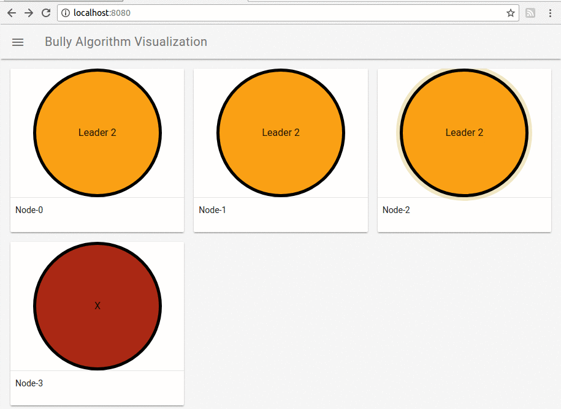
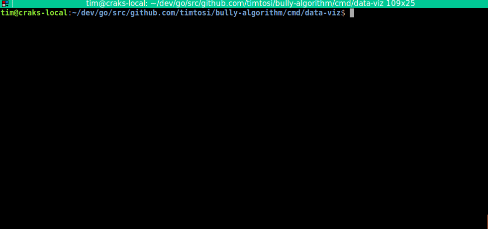
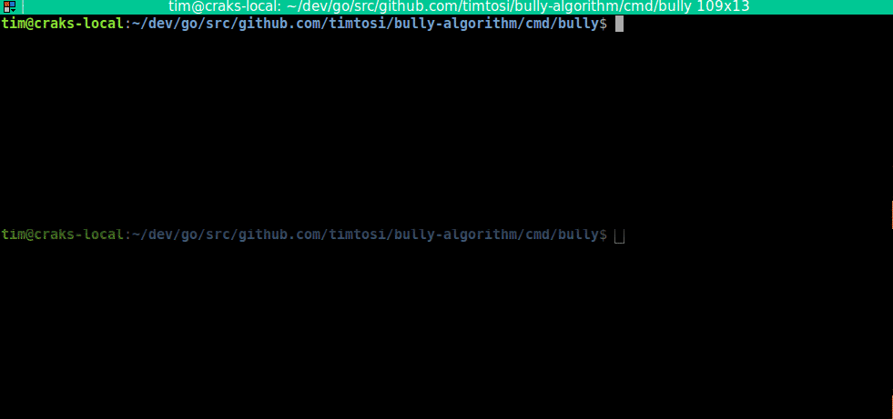

# Bully Algorithm Visualization

[](https://godoc.org/github.com/timtosi/bully-algorithm)
[](https://codecov.io/gh/TimTosi/bully-algorithm)
[](https://goreportcard.com/report/github.com/timtosi/bully-algorithm)




## Table of Contents
- [About](#what-this-repository-is-about-?)
- [Bully Algorithm](#what-is-the-bully-algorithm-?)
- [Quickstart with Docker](#with-docker)
- [Quickstart with binaries](#compiling-binaries)
- [FAQ]


## What this repository is about ?

This repository contains source code of an implementation of the bully algorithm
written in Go and a small browser visualization tool.

This has been made for learning purposes about [distributed algorithms](https://en.wikipedia.org/wiki/Distributed_algorithm), Bully algorithm being the simplest leader election algorithm to implement.

Finally, I feel like implementing an algorithm myself helps me to understands it
better and I thought it could be interesting to someone else.

## What is the Bully algorithm ?

The [Bully algorithm](https://en.wikipedia.org/wiki/Bully_algorithm) is one of
the simplest algorithm made to design a coordinator among a set of machines.

## Quickstart

First, go get this repository:
```golang
go get -d github.com/timtosi/bully-algorithm
```


Then compiles and launch the visualization server:
```golang
cd $GOPATH/src/github.com/timtosi/bully-algorithm/cmd/data-viz
go build && ./data-viz
```



Finally launch at least two nodes with specifying their ID in argument:
```golang
cd $GOPATH/src/github.com/timtosi/bully-algorithm/cmd/bully
go build && ./bully 0
```

> **/!\ If you launch this project through binaries**: IDs should by default
> be comprised between 0 to 4 but you should be able to update
> [peer address default configuration](https://github.com/TimTosi/bully-algorithm/blob/master/cmd/bully/conf.go#L23-L27) easily.




You can access the visualization through your browser at `localhost:8080`.


## License

Every file provided here is available under the [MIT License](http://opensource.org/licenses/MIT).

## Not Good Enough ?

If you encouter any issue by using what is provided here, please
[let me know](https://github.com/TimTosi/bully-algorithm/issues) ! 
Help me to improve by sending your thoughts to timothee.tosi@gmail.com !
